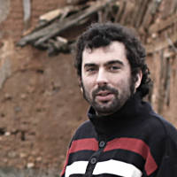

# Artículos

## Artículos

## [Analytics, Free Data y otras Networks](untitled.md)

Como gestionar nuestros datos para hacerlos más accesibles y útiles

## [Cartografía participativa: OpenStreetMap](cartografia-participativa-openstreetmap.md)

Historia y evolución de la cartografía participativa

## [Jornada de presentación de software con licencia libre para uso científico](jornada-de-presentacion-de-software-con-licencia-libre-para-uso-cientifico.md)

El objetivo principal de esta actividad fue el de compartir conocimientos e experiencias alrededor del Software Libre de uso Científico, así como presentar la versión 5.0 de EpiLinux.

## [Los proyectos Wikimedia](los-proyectos-wikimedia.md)

Además de la Wikipedia, hay otros proyectos hermanos, todos ellos bajo el amparo de la Fundación Wikimedia.

## [Edición profesional de audio con Linux](edicion-profesional-de-audio-con-linux.md)

Hydrogen. Un secuenciador profesional de batería, multiplataforma y de licencia libre

## [Las Administraciones Públicas que favorecen unos salarios mediocres](la-aapp-que-favorece-unos-salarios-mediocres.md)

Participar en un concurso no es tema baladí para aquellas que se inician en estos trámites. Se solicita información de todo tipo, como es lógico, en referencia a la solvencia técnica y económica.

## [Personas que difunden la cultura libre, Francisco Estrada](personas-que-difunden-la-cultura-libre-francisco-estrada.md)

Serie de artículos para dar a conocer a individuos y colectivos, que ayudan en la difusión o colaboran de forma significativa en la cultura libre.

## [root o no root? Esa es la cuestión…](root-o-no-root-esa-es-la-cuestion....md)

**Laboratorio Android**  
\(parafraseando a Hamlet, -acto tercero, escena primera- de W. Shakespeare\)

## [El ecosistema de OpenStreetMap](el-ecosistema-de-openstreetmap.md)

Qué es y qué no es OSM?

## [Dibujos libres](dibujos-libres.md)

 Dibujos liberados por la autora bajo licencias libres Creative Commons

## [Fotografías libres](fotografias-libres.md)

Fotos liberadas por el autor bajo licencias libres Creative Commons

## [Colaboradores](colaboradores.md)

