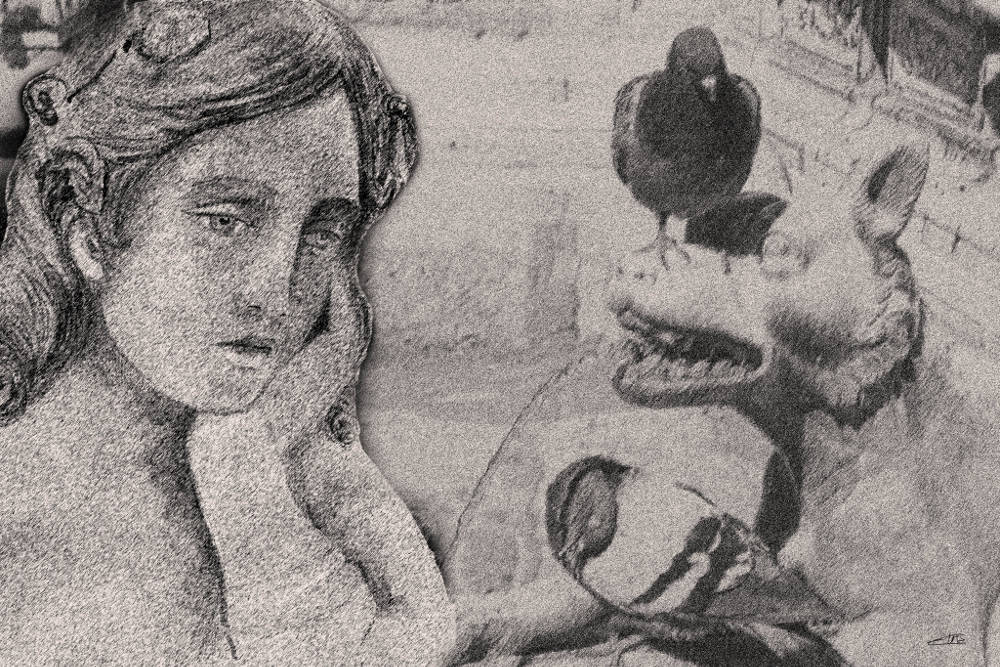
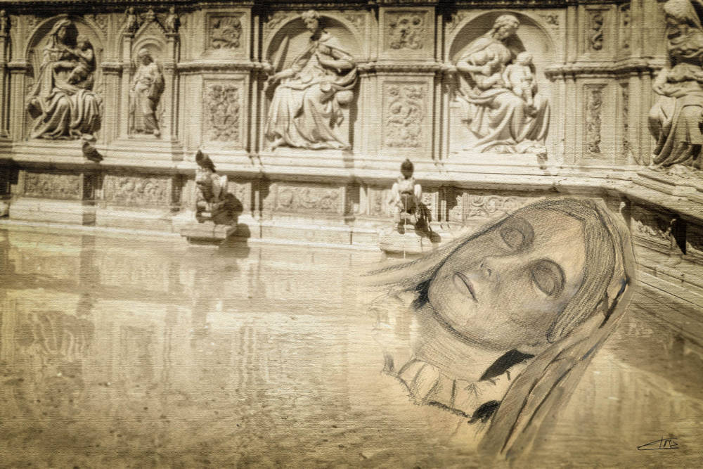

# Dibujos libres

## Dibujos libres

### Ninfa en Siena

AUTOR: Elsa Martínez  
TÍTULO: Ninfa en Siena  
TÉCNICA: Dibujo a tinta y lápiz pastel con tratamiento digital   
FECHA: 2018  
LICENCIA: Creative Commons BY - SA 4.0  
**\*Dibujo inspirado en esculturas de Luigi Pampaloni y Lorenzo Bartolini ubicadas en la Galería de la Academia en Florencia.**

### Rest in Siena

AUTOR: Elsa Martínez  
TÍTULO: Rest in Siena  
TÉCNICA: Dibujo a tinta y lápiz pastel con tratamiento digital  
FECHA: 2018  
LICENCIA: Creative Commons BY - SA 4.0  
**\*Dibujo inspirado en monumento a Sofía Zamoyska de Lorenzo Bartolini ubicadas en la Galería de la Academia en Florencia.**

## [Siguiente artículo](fotografias-libres.md)

