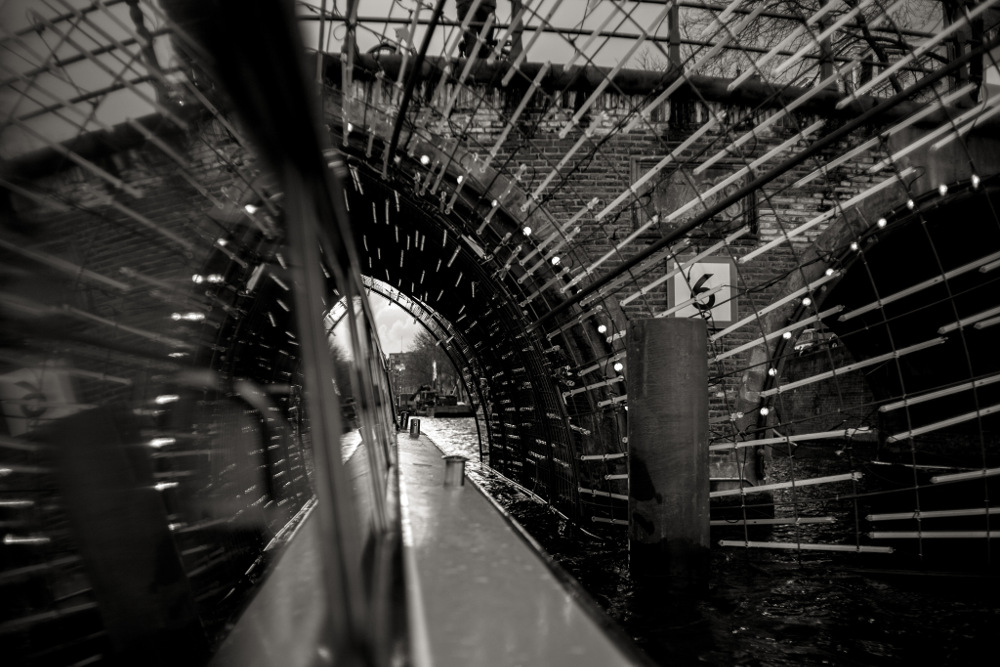
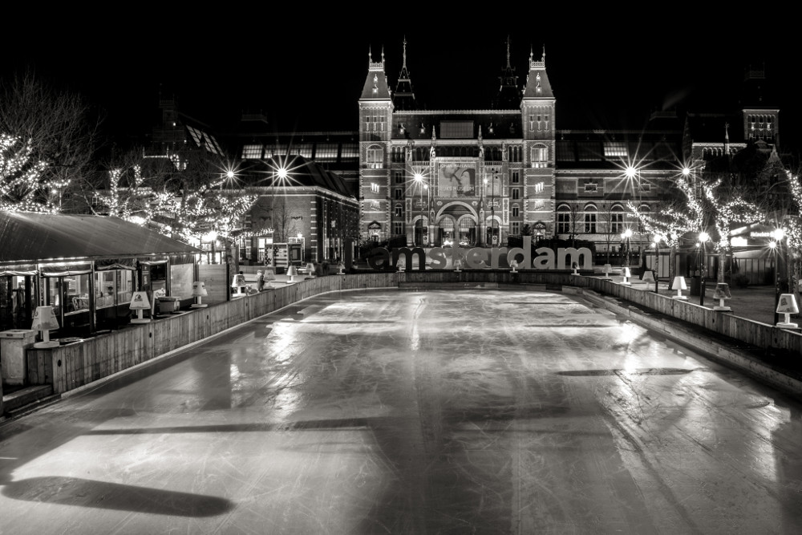

# Fotografías libres

## Fotografías libres

### Blanco y negro

En este número dos fotos de Amsterdam en blanco y negro, fotos realizadas en invierno.  
Como bien dice el título de este tipo de foto, blanco y negro; es decir, mucho contraste, blancos definidos y negros muy negros. Un suave tono sepia le dará un pequeño toque cálido.

## [Contraportada](contraportada.md)

