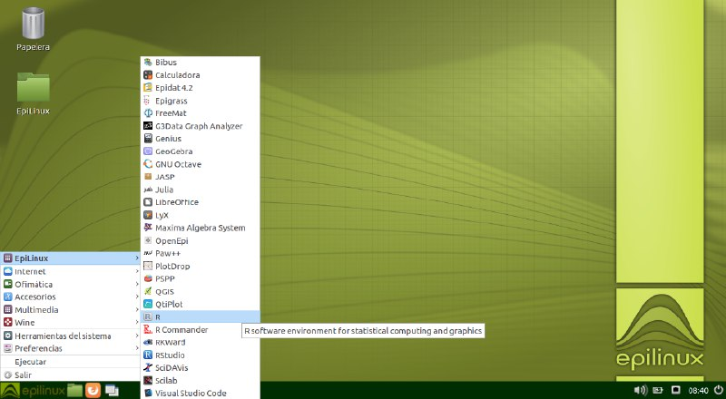

# Jornada de presentación de software con licencia libre para uso científico

## Jornada de presentación de software con licencia libre para uso científico

La jornada de presentación de software con licencia libre para uso científico estuvo organizada por la Asociación de Usuarios e Software Libre de Terra de Melide \(MeLiSA [http://www.melisa.gal/](http://www.melisa.gal/) tuvo lugar en la facultad de Matemáticas de la Universidad de Santiago de Compostela el pasado día 12 de abril de 2018 y contó con el apoyo de la Axencia para a Modernización Tecnolóxica de Galicia \(AMTEGA [https://amtega.xunta.gal/](https://amtega.xunta.gal/)\) y de la propia Facultad.

El objetivo principal de esta actividad fue el de compartir conocimientos e experiencias alrededor del Software Libre de uso Científico, así como presentar la versión 5.0 de EpiLinux.

La inauguración de la misma corrió a cargo de Doña Elena Vázquez Cendón, Decana de la Facultad de Matemáticas \(USC\) y Don Rafael Rodríguez Gayoso, Presidente de la Asociación MeLiSA.

El programa de la jornada contó con tres charlas:

*  Presentación de MeLiSA. Licencias libres \(Rafael Rodríguez Gayoso, MeLiSA\)
*  Software matemático y estadístico \(María José Ginzo Villamayor, Universidad de Santiago de Compostela\).
*  Presentación de Epilinux 5.0 \(Miguel Ángel Rodríguez Muíños, Consellería de Sanidade\)

A continuación se presenta un pequeño resumen de cada una de ellas:

### **Presentación de MeLiSA. Licencias libres**

 **MeLiSA \(en la Ilustración 2 se puede ver el logo\) es una asociación sin ánimo de lucro cuyos objetivos son:**

*  **Promocionar y divulgar el concepto de software libre y fomentar su uso**
*  Fomentar y apoyar los proyectos de software libre, especialmente aquellos desarrollados por sus miembros. Impulsar e respaldar las iniciativas de software libre
*  Adaptación del software libre a la lengua gallega.
*  Promover el uso de estándares abiertos en la sociedad de la información y en el ámbito tecnológico.
*  Formación de nuevas tecnologías en el campo del software libre en los diferentes ámbitos \(educativo, empresarial,…\)

Rafael también habló sobre las Licencias libres \(véase Ilustración 3\). Comenzó presentando la definición de licencia en la Wikipedia, “Una licencia es, en derecho, un contrato mediante lo cuál una persona recibe de otra el derecho de uso de varios de sus bienes, normalmente de carácter no tangible o intelectual, a cambio del pago de un monto determinado por el uso de los mismos.”

Y a continuación comenzó con las licencias libres. Este tipo de licencias ceden: el derecho de copia y el código fuente. A veces también se ceden: derechos de modificación y explotación comercial.

Aunque se libere el código también existen ciertos deberes como son: reconocer la autoría y reutilizar la misma licencia.

Las licencias constan de derechos \(que el autor concede a la otra parte, que es lo que va a poder hacer\), limitaciones y prohibiciones \(que la otra parte debe respetar, que es lo que no va a poder hacer\), garantías y responsabilidades \(el autor limita sus responsabilidades, el autor limita las garantías de la obra, disclaimers\) y jurisdicción competente de derecho aplicable.

Las licencias se clasifican en tres grupos: privativas o restrictivas, semilibres y libres.

### **Software matemático e estadístico**

Mª José Ginzo \(véase Ilustración 4\) realizó un recorrido por el diferente software matemático y en particular estadístico tanto libre como comercial de uso científico:

*  Para **álgebra** presentó los siguientes softwares: Axiom, Cadabra, CAS, CoCoA, Derive, GAP, Macyma, Maple, MuPAS, MathCAD, PARI/GP, Scilab y Xcas, ...
*  **Geometría**: Geogebra y Mathematica, ...
*  **Ecuaciones diferenciales**: Dynamic Solver, ...
*  **Matemática Aplicada, análisis** **numérico** **y** **simulación**: AMoreAccurateFourierTransform, Fluent, FreeMat, Gnuplot, Graph, MapleSim, Matlab, Modelica, Octave, Scilab, SciPy, ZeGrapher, ...
*  Software y lenguages de programación para **Estadística e Investigación Operativa**: Ampl, Epidat, JASP, Lindo, Lingo, Maple, Maxima, Microsoft Excel, OpenOffice Calc, PSPP, Python, R, Rcmdr, Microsoft R Application Network, S-PLUS, SAS, SPSS,Stata, Gurobi, CPLEX, Lindo, ...
*  Otro software empleado en **economía, econometría** **y** **estadística** en general: Demetra+, EViews, Gretl, Minitab, OxMetrics, TSW, ...

 Mª José también aprovechó la ocasión para hablar de las Xornadas de Usuarios de R en Galicia, [https://www.r-users.gal/](https://www.r-users.gal/), y de las Jornadas de Usuarios de R – R-Hispano, [http://r-es.org/](http://r-es.org/). Así mismo presentó el grupo R-ladies, que es una organización mundial para promover el uso de R entre las mujeres, [https://rladies.org](https://rladies.org/). Así mismo en España, existe el grupo R-Ladies Madrid, que es la primera comunidad de España de R para mujeres, [https://www.meetup.com/es-ES/rladies-madrid/](https://www.meetup.com/es-ES/rladies-madrid/).

 Presentó también una serie de software matemático multiuso y multiplataforma como: DataMelt, Epilinux, MathBuntu, Power Bi, SageMath; así como software relativo a sistemas de información geográficas \(GIS\): ArcGIS, gvSIG, MapInfo, QGIS, SGA GIS, ...

 Aconseljó que existen diferentes herramientas para el control de versiones \(GitHub, Microsoft SourceSafe, Subversión...\) y que es una buena práctica comentar todo el código que se desarrolle.

 Una vez que se dispone de un amplio abanico de herramientas para lleva a cabo los cálculos matemáticos en general hay que escribir los resultados, para eso habló de Microsoft Word y Libre Office Writer y más científico el Latex \(con diferentes editores: TeXnicCenter, TeXmaker, TeXstudio, TeXworks, ShaeLaTeX, OverLeaf, WinEdt\). No llega con escribir los resultado también hay que presentarlos, para ello, Microsoft Power Point, LibreOffice Writer, Beamer, Shiny. Desde que se tienen escritos los resultados hay que publicarlos, mostró así una serie de revistas científicas donde publicar los trabajos.

 La presentación de Mª José Ginzo se puede consultar en [http://eio.usc.es/pub/mjginzo/index.php/es/xornada-software-libre-cientifico](http://eio.usc.es/pub/mjginzo/index.php/es/xornada-software-libre-cientifico)

### **Presentación de Epilinux 5.0**

Miguel Rodríguez \(véase Ilustración 6\), presentó la nueva versión de Epilinux \([https://www.sergas.es/Saude-publica/EpiLinux-software](https://www.sergas.es/Saude-publica/EpiLinux-software)\). Es un sistema operativo, de libre distribución orientado principalmente al uso de herramientas de análisis epidemiológico y bioestadístico. Está especialmente orientado a todas aquellas personas, tanto profesionales como estudiantes, que desarrollen sus actividades en el campo de la epidemiología, la bioestadística y los estudios de salud, en general. En la Ilustración 5 se tiene una captura junto con el logo del mismo.

Dos de los retos actuales, en canto a la utilización de software como base para a realización de estudios científicos, son la posibilidad de acceso al código fuente para poder reutilizarlo, modificarlo o distribuirlo y la reducción de costes por licencia de uso.

EpiLinux e un sistema operativo completo basado en GNU/Linux. Este entorno le outorga un excelente rendimiento y ligereza, además de una gran usabilidad.

Esta distribución acerca un conjunto de programas de uso general \(ofimática, multimedia, internet, …\) y una recompilación de software científico. Entre ellos, podemos destacar R con sus entoros gráficos Rcommander y Rstudio y una colección preinstalada de librerías especializadas. Además, se incluye software de referencia en el campo de la Epidemiología como Epidat 4, OpenEpi, … de la Bioestadística como JASP, Octave, PSPP, SciLab,… y, como Sistema de Información Geográfica, QGIS.

La lista completa del software que incluye es la siguiente: Epidat, Epigrass, FreeMat, GeoGebra, GNU Octave, JASP, LibreOffice, Maxima Algebra System, OpenEpi, PlotDrop, PSPP, QGIS, QtiPlot, R, R Commander, RKWard, RStudio, SciDAVis y Scilab.

Se actualiza desde los repositorios originales de estos programas lo que consigue que el sistema disponga de las últimas versiones en todo momento y ofrece la posibilidad de ejecutarlo desde un pendrive en modo “live” evitando, así, la interacción con instalaciones previas de otros Sistemas Operativos. Otra opción es ejecutarlo desde una máquina virtual, embebido en un sistema operativo anfitrión. También se puede instalar en el disco duro del equipo como única opción en modo compartido con otro sistema.

La nueva versión de EpiLinux permite disponer, en un entorno totalmente configurado, actualizado, homogéneo, de libre distribución y gratuito, de las herramientas necesarias para la realización de estudios epidemiológicos y/o bioestadísticos.

Este sistema operativo forma parte de las actividades que Melisa realiza en el marco del convenio de colaboración firmado con la Axencia para a Modernización Tecnolóxica de Galicia \(AMTEGA\), e incluidas en el [Plan de Acción de Software Libre 2017 d](https://amtega.xunta.gal/sites/default/files/20170519-plansoftwarelibre2017.pdf)[e l](https://amtega.xunta.gal/sites/default/files/20170519-plansoftwarelibre2017.pdf)[a Xunta de Galicia](https://amtega.xunta.gal/sites/default/files/20170519-plansoftwarelibre2017.pdf).

A todos los asistentes se les regaló un libro “Moodle con Geogebra e unhas pinceladas de Wiris”\(\*\) cedido por la [oficina de Normalización Lingüística d](http://www.usc.es/gl/servizos/snl/)[e l](http://www.usc.es/gl/servizos/snl/)[a Universidad de Santiago de Compostela](http://www.usc.es/gl/servizos/snl/).

Toda la información de la jornada se puede consultarse en [https://gaioso.gitlab.io/epilinux/\#/](https://gaioso.gitlab.io/epilinux/#/)

\(\*\) De la Torre Fernández, Enrique; Gesteira Losada, María Esperanza; Larrosa Cañestro, Ignacio; Pereiro Carbajo, Débora; Rodríguez Somoza, Aia; Zacarías Maceiras, Fernando. \(2011\) MOODLE CON GEOGEBRA E UNHAS PINCELADAS DE WIRIS. Lemniscata, nº 8. Anaya. ISBN:978-84-207-9899-8.

## [Siguiente artículo](los-proyectos-wikimedia.md)

