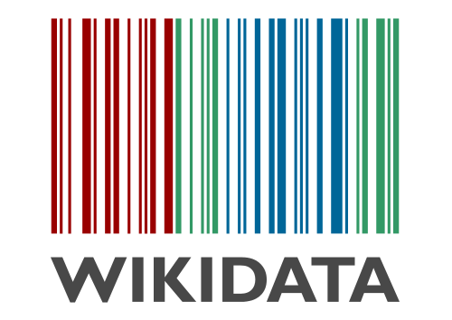

# Los proyectos Wikimedia

## Los proyectos Wikimedia

[Wikipedia](https://es.wikipedia.org/wiki/Wikipedia:Portada) es una enciclopedia colaborativa. Actualmente hay Wikipedia en 288 lenguas. Es uno de los sitios web más visitados en todo el mundo \(excepto en Turquía, donde está prohibido su acceso desde abril de 2017!\), y nos resulta muy útil cuando queremos conocer algún dato puntual. Su uso también tiene gran impacto en el campo educativo, ya sea desde la enseñanza primaria a la Universidad.

Es colaborativa porque sus contenidos están desarrollados por personas voluntarias. Una de las principales carencias a este respecto es que sólo un 15 % de las personas que colaboran son mujeres, por lo que hay una cierta brecha de género en los contenidos.

Además de la Wikipedia, hay otros proyectos hermanos, todos ellos bajo el amparo de la Fundación Wikimedia.  
Desde el [Wiktionary](https://www.wiktionary.org/) \(con definiciones léxicas\) al [Wikiquotes](https://es.wikiquote.org/wiki/Portada) \(con citas\) pasando polo [Wikisources](https://es.wikisource.org/wiki/Portada) \(fuentes documentales escritas\), [Wikinews](https://www.wikinews.org/) \(noticias\) o [Wikivoyages](https://www.wikivoyage.org/) \(una especie de guías turísticas\).

Pero por encima de estos hay dos proyectos muy importantes, que sirven de respaldo a Wikipedia y que tienen una existencia más silenciosa: [**Wikidata**](https://www.wikidata.org/wiki/Wikidata:Main_Page) y [**Commons**](https://commons.wikimedia.org/wiki/Main_Page).

### Commons

Commons es el repositorio de documentos audiovisuales. En junio de 2018 tenía 47 millones de archivos, principalmente fotografías, pero también vídeos, archivos de sonido, o ilustraciones.  
En buena medida las imágenes están categorizadas de forma jerárquica, lo que facilita su busca. Además se intenta que las imágenes estén geolocalizadas.  
Hay ciertos criterios de calidad, y se realizan concursos para escoger las mejores fotos. Así como en Wikipedia es posible editar de forma anónima, para cargar archivos en Commons es necesario tener creada una cuenta de usuario o usuaria. Se puede escoger un nick cualquiera, claro, pero es importante tener una cuenta para citar la autoría cuando se le da uso a las fotos.  
Cada persona escoge la licencia con que sube sus propias imágenes \(yo utilizo la CC-4.0, pero es cuestión de gustos\).  
Por supuesto, pueden subirse también imágenes que estén en dominio público, como fotos antiguas.

### Wikidata

Wikidata, por su parte, es una base de datos documental que acoge ítems para cada concepto, ya sea una persona, un río, un libro, o una corriente filosófica. A cada ítem se le asignan determinadas afirmaciones: población en un determinado año, número atómico, fecha de nacimiento, ISBN etc. Además, pueden cruzarse datos con otras bases como IMDb o dialnet, por poner dos ejemplos. Podría decirse que si en Wikipedia hay artículos con una redacción enciclopédica y una información estructurada, Wikidata es un frío repositorio de datos.

### Para que sirve Wikidata?

Pues por un lado para actualizar información en Wikipedia de forma más cómoda, pues como esta puede tomar algunos datos de aquella, si ponemos un dato nuevo en Wikidata es factible que Wikipedia se actualice de forma automática. Aparte, permite cruzar datos para llevar a cabo estudios estadísticos.  
Por ejemplo: ¿cuantas mujeres \(con ítem en Wikidata, claro!\) nacidas en la provincia de Pontevedra estudiaron en la Universidad de Santiago entre 1900 y 1950? ¿O cuantos futbolistas islandeses jugaron en equipos del País Vasco?

Wikidata y Commons también están relacionados entre ellos. Así, si a una parroquia del municipio de Curtis le asigno en Wikidata una foto que subí a Commons, esa foto aparece directamente en todas las Wikipedias que tengan artículo sobre esa parroquia y que usen el modelo determinado. Lo mismo pasa con personas, grupos de música, etc.

De cara al futuro se está estudiando la posibilidad de que Wiktionary se pase a Wikidata. Yo soy partidario: a cada ítem léxico se le asigna en cada lengua una definición, una etimología, relación con homónimos y sinónimos y lo que haga falta. Wikidata también podría acabar con el proyecto Wikispecies, pues a cada forma de vida se le asigna su correspondiente reino, filo, clase, orden, familia y género.  
Los taxons están relacionados con su correspondiente artículo enciclopédico en Wikipedia, y con su correspondiente categoría de imágenes en Commons.

En Commons ya se están subiendo numerosas imágenes en 3D y fotografías en 360º.

### ¿Y cual es el futuro?

De momento sólo son divagaciones, pero a lo mejor dentro de unos años podrían subirse olfatos, por ejemplo, si hubiese dispositivos que permitiesen codificarlos y después reproducirlos. ¿Por qué no?

Algo que ya está muy extendido en los proyectos Wikimedia es el uso de bots.  
Son fácilmente programables para llevar a cabo ediciones masivas: desde categorizaciones de imágenes, a correcciones ortográficas o actualizaciones de información.

Quizá podremos hablar de ellos en otro artículo!

## [Siguiente artículo](edicion-profesional-de-audio-con-linux.md)

