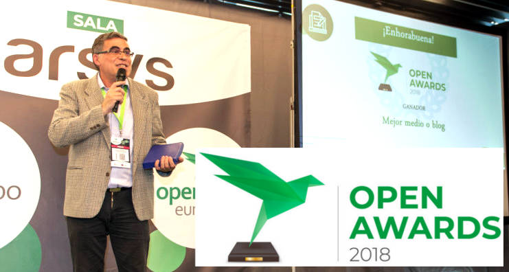

# Personas que difunden la cultura libre, Francisco Estrada

## Personas que difunden la cultura libre, Francisco Estrada

En este caso hablamos de otro podcaster, Francisco Estrada, más conocido como Paco Estrada.

### Podcasting – “Compilando Podcast” 

[Compilando Podcast](https://compilando.audio/), ha sido recientemente uno de los ganadores del [**Open Awards 2018**](https://openexpoeurope.com/es/ganadores-open-awards-2018/) en la categoría de **Mejor medio o blog**. Enhorabuena, Paco!

Paco Estrada define su programa como:

Un programa dedicado a GNU/linux y Sotfware Libre. Personas y cosas que destacan dentro del mundo del software libre y noticias comentadas de la actualidad de este mundo.

No se que herramientas de compilación utiliza Paco para gestar su podcast, llamado “Compilando Podcast” \(seguramente CCG porque es un apasionado de gnu/linux\) pero el resultado son unos programas muy interesantes, sin bugs de ningún tipo y optimizados a tope para su audiencia.

Cuando escuchas a Paco, le notas su paso por la radio profesional. Posee una voz bien entrenada y una cabeza bien amueblada, preparada para llevar a buen puerto las entrevistas que nos brinda en sus programas \(y puedo dar fe de su buen hacer porque lo he visto entrevistando en vivo y en directo a la gente de [NOlegaltech Radio](http://www.ivoox.com/podcast-nolegaltech-radio_sq_f1446265_1.html)\).

Realiza una labor de difusión impagable. Es muy recomendable escuchar su podcast para poder estar al tanto de los grandes eventos españoles relacionado con el mundo del software libre, como ha venido dejando constancia de ello estos últimos años hablándonos de la Akademy 2017, OpenExpo 17, Librecon 2017, Ubucon Europe 2018 \(todo un maratón de fondo ha sido este\), Flisol 2018 y otros eventos que llegarán este año.

En sus programas encontramos entrevistas en las que no se olvida de hablar de lo humano, donde toca también la parte técnica que nos pierde a los apasionados de este mundillo. Estas entrevistas se notan que han sido preparadas a fondo, con tiempo y cariño por la materia, charlando con desarrolladores o personas relacionadas con importantes proyectos como KDE, Gnome, Fundación Apache, Agasol, Red Hat, Fedora, Debian entre otros.

Paco forma parte de varios proyectos colaborativos podcasteros:

Maratón Linuxero [https://maratonlinuxero.org/](https://maratonlinuxero.org/) y Killall Radio [https://killallradio.com/](https://killallradio.com/) \(2 proyectos muy interesantes de los que hablaremos en futuras ocasiones\).

Puedes encontrar los programas de Compilando Podcast alojados en su página web:

[https://compilando.audio/](https://compilando.audio/)

o en la plataforma de podcasting ivoox:

[https://www.ivoox.com/podcast-compilando-podcast\_sq\_f1388684\_1.html](https://www.ivoox.com/podcast-compilando-podcast_sq_f1388684_1.html)

### Canal de YouTube

Compilando Podcast dispone también de un canal de YouTube, para aquellos que prefieran acceder a sus programas a través de esta plataforma:

[https://www.youtube.com/channel/UCr4lDlQzgOkbtttgQQnDorw](https://www.youtube.com/channel/UCr4lDlQzgOkbtttgQQnDorw)

Todos los programas tienen información interesante, pero voy a destacar dos de mis favoritos:

- Podcast 18 – Desarrollo de Debian con Laura Arjona y Firefox Quantum

[https://www.youtube.com/watch?v=BMsDomkbIK4](https://www.youtube.com/watch?v=BMsDomkbIK4)

y el programa colaborativo entre Compilando Podcast y Nolegaltech Radio en el que tuve el placer de participar:

- Podcast 16 – Resumen LibreCon 2017 y Crossover NoLegalTech Radio

[https://www.youtube.com/watch?v=LWqcu3YkNvg](https://www.youtube.com/watch?v=LWqcu3YkNvg)

En su canal personal, Paco tiene colgado un interesante tutorial sobre Jack \(tema que también nos gusta por estos lares y tratamos en el número 00 de Generación Ñu\):

[https://novuslinux.wordpress.com/2017/01/31/introduccion-a-jack-y-cadence-produccion-de-sonido-en-gnulinux/](https://novuslinux.wordpress.com/2017/01/31/introduccion-a-jack-y-cadence-produccion-de-sonido-en-gnulinux/)

### Canal de Telegram

Si quieres estar al tanto de las publicaciones de Paco Estrada, puedes hacerlo a través de este canal:

[https://t.me/compilandopodcast](https://t.me/compilandopodcast)

### Enlaces de interés

Web  
[https://compilando.audio/](https://compilando.audio/)

Twitter  
​[https://twitter.com/CompilanPodcast](https://twitter.com/CompilanPodcast)​

Si quieres saber más sobre este gran comunicador, puedes escuchar varias entrevistas que le han hecho en diferentes medios:

- Entrevista de otro gran podcaster, [Yoyo Fernández](https://twitter.com/yoyo308), a Paco Estrada en su programa [Salmorejo Geek](https://salmorejogeek.com/):

[https://novuslinux.wordpress.com/2016/11/28/entrevista-en-salmorejo-geek/](https://novuslinux.wordpress.com/2016/11/28/entrevista-en-salmorejo-geek/)

- Entrevista a Paco Estrada en radioteca:

[https://radioteca.net/audioseries/entrevista-a-paco-estrada-compilando-podcast/](https://radioteca.net/audioseries/entrevista-a-paco-estrada-compilando-podcast/)

### Petición para Paco

Y ya para terminar, dejo aquí una petición para Paco: me gustaría que en uno de sus programas de Compilando Podcast hablara a fondo sobre las novedades de los simuladores de vuelo libres para GNU/Linux, a los que es aficionado, como [FlightGear.](http://home.flightgear.org/)

## [Siguiente artículo](root-o-no-root-esa-es-la-cuestion....md)

